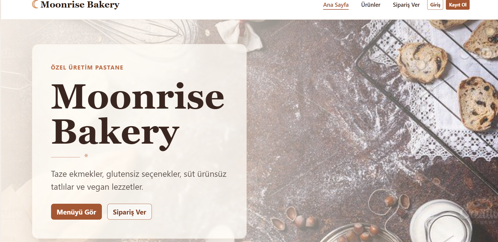
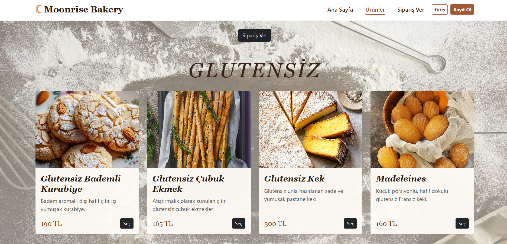
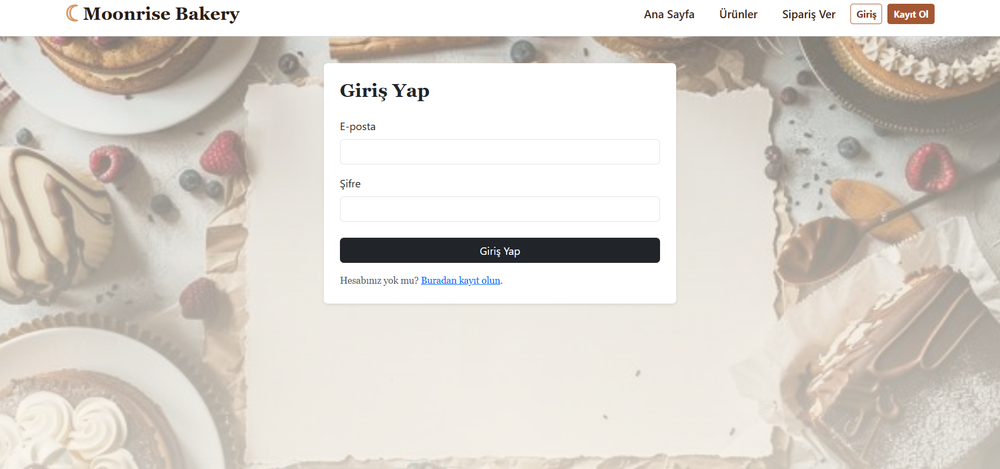
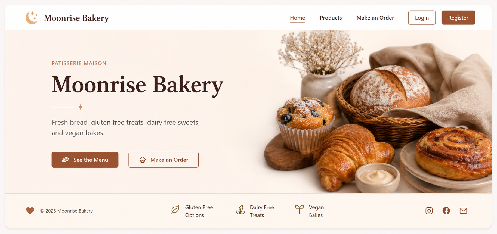

# Moonrise Bakery - 

Bu proje, PHP + MySQL ile yapılmış basit bir pastane sipariş yönetimi uygulamasıdır. Öğrenci olarak ders kapsamında hazırladım.

## Genel Bilgi

- Teknolojiler: PHP (yalın), MySQL/MariaDB, Bootstrap (CDN), HTML, CSS)
- Veritabanı: `bakery_db` (schema.sql içinde tanımlıdır).
- Klasör yapısı: proje kökünde PHP dosyaları ve `includes/` wrapper klasörü bulunur.

## Özellikler 

1. Kullanıcı kaydı: `register.php` — şifre `password_hash()` ile saklanır.
2. Oturum açma/kapama: `login.php`, `logout.php` — `session` kullanılmıştır.
3. Bilgi girişi (Create): `order.php` ile sipariş oluşturma.
4. Listeleme (Read): `orders.php` içinde kullanıcıya ait siparişlerin listelenmesi.
5. Güncelleme (Update): `order.php?id=...` üzerinden sipariş düzenleme.
6. Silme (Delete): `delete_order.php` ile sipariş silme.
7. CSS kütüphanesi: Bootstrap CDN kullanılıyor.

## Kullanım

- Kayıt olun: `register.php` — en az 6 karakter şifre gereklidir.
- Giriş yapın: `login.php` — başarılı giriş sonrası `orders.php` sayfasına yönlendirme.
- Yeni sipariş vermek için `order.php` kullanın.
- Siparişlerinizi `orders.php` sayfasında görebilir, düzenleyebilir veya silebilirsiniz.
- Parolalar `password_hash()` ile saklanır.
- Oturum kontrolü `$_SESSION` ile yapılır.

video linki:

video linki:

screenshots:

